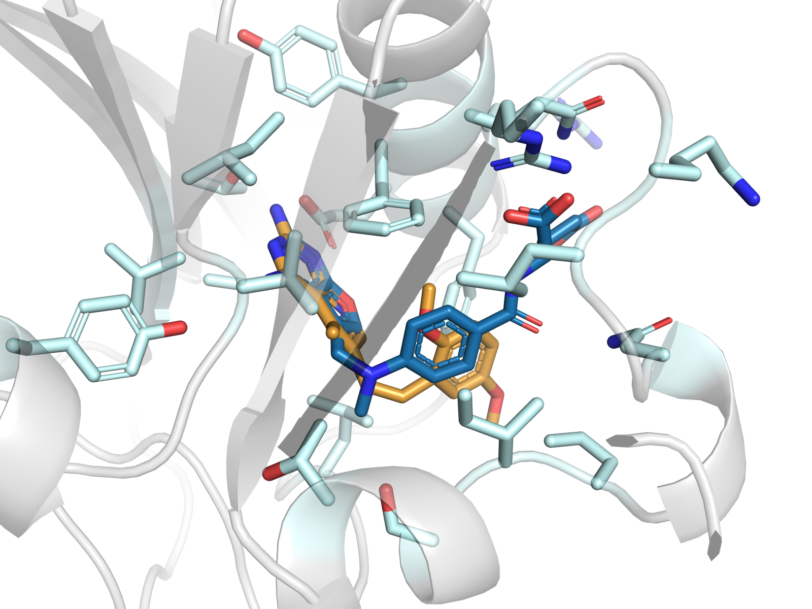
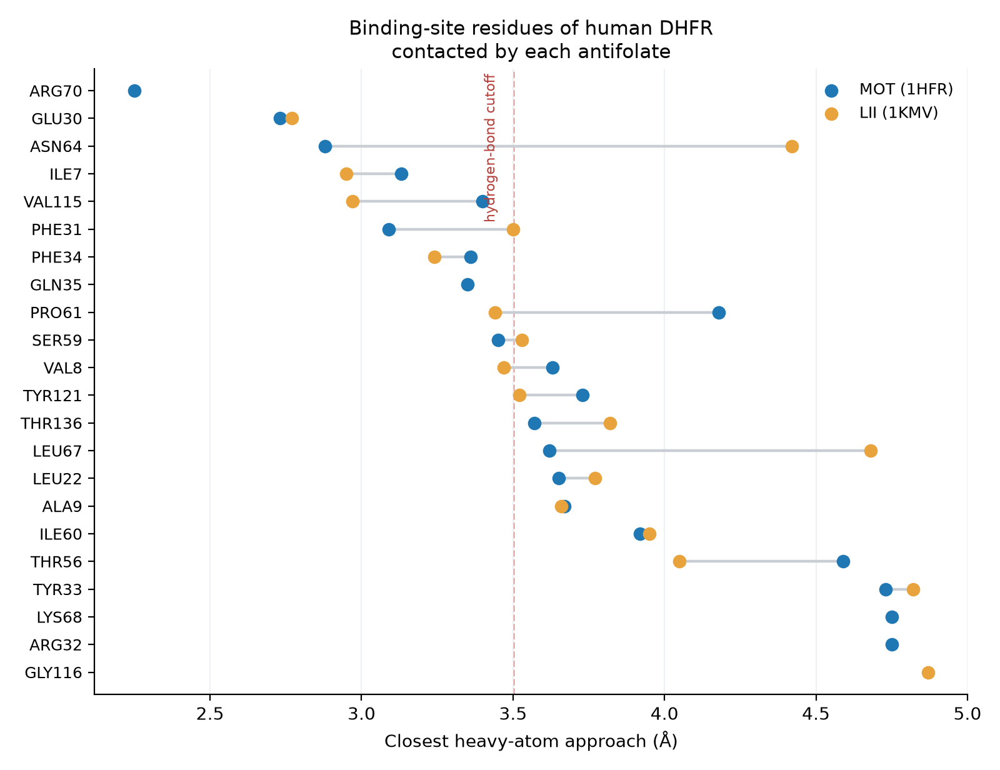

# Protein–Ligand Interaction Analysis of Human DHFR Antifolate Complexes

Comparative structural analysis of two antifolate inhibitors bound to **human dihydrofolate reductase (hDHFR)**, a validated anticancer and antimicrobial drug target. The pipeline maps every heavy-atom contact each inhibitor makes with the binding site, classifies the interactions, and quantifies which pocket residues are shared versus inhibitor-specific — the kind of binding-site fingerprint used to guide lead optimisation in structure-based drug design.

| | |
| --- | --- |
| **Structures** | [1HFR](https://www.rcsb.org/structure/1HFR) · 2.10 Å · hDHFR + NADPH + **MOT**, a *classical* furo[2,3-*d*]pyrimidine antifolate carrying an L-glutamate tail<br>[1KMV](https://www.rcsb.org/structure/1KMV) · 1.05 Å · hDHFR + NADPH + **LII** (SRI-9662), a *lipophilic* pyrido[2,3-*d*]pyrimidine antifolate |
| **Methods** | Biopython `Bio.PDB` KD-tree neighbour search, geometric interaction typing, PyMOL molecular graphics |
| **Output** | Per-contact CSV tables, residue-level comparison, summary JSON, publication figures |

<p align="center">
  <br>
  <em>MOT (blue) and LII (orange) superposed in the hDHFR active site. Cα RMSD between the two structures is 0.51 Å, so the differences below are ligand-driven rather than conformational.</em>
</p>

## Key findings

Both inhibitors are anchored by the same conserved pharmacophore, then diverge:

- **17 of the pocket residues are shared.** Both 2,4-diaminopyrimidine head groups form a bidentate salt bridge to **Glu30**, plus hydrogen bonds to the **Ile7** and **Val115** backbone carbonyls — the canonical hDHFR recognition motif, and the part of the scaffold that should be preserved in any analogue.
- **MOT builds a larger polar network:** 10 hydrogen bonds (7 of them salt bridges) versus 4 for LII. Its glutamate tail reaches **Arg70** (2.25 Å, the shortest contact in either structure) and **Asn64**, neither of which LII engages.
- **LII compensates with hydrophobic packing:** 74 hydrophobic contacts versus 66 for MOT despite having 25 heavy atoms to MOT's 32. Its dimethoxyphenyl tail sits against **Phe34** and **Pro61** instead of reaching the polar Arg70 subsite.

| Metric | MOT (1HFR) | LII (1KMV) |
| --- | ---: | ---: |
| Contacts ≤ 5 Å | 330 | 274 |
| Residues contacted | 21 | 18 |
| Hydrogen bonds | 10 | 4 |
| Salt bridges | 7 | 2 |
| Hydrophobic contacts | 66 | 74 |
| Shortest contact | 2.25 Å (Arg70) | 2.77 Å (Glu30) |

**Interpretation.** The Arg70/Asn64 subsite is engaged only by the classical antifolate's charged glutamate tail; the lipophilic analogue trades that electrostatic anchoring for shape complementarity. That trade-off is the design lever — a lipophilic scaffold that recovers even one Arg70 contact would combine LII's membrane permeability with MOT's binding enthalpy.

**Caveat.** The two entries differ in resolution (2.10 Å for 1HFR, 1.05 Å for 1KMV), so individual distances are more precisely determined in 1KMV. Both structures are wild-type at Phe31 and superpose to 0.51 Å Cα RMSD, so the residue-level comparison is sound, but sub-0.1 Å distance differences should not be over-interpreted.

<p align="center">
  
</p>

## Quick start

```bash
pip install -e ".[dev]"   # or: pip install -r requirements.txt
make analysis             # downloads PDB files, writes results/
make figures              # PyMOL renders (requires a PyMOL install)
make test
```

The CLI is also usable directly:

```bash
python -m plinter.cli --cutoff 4.5 --results-dir results/strict
python -m plinter.cli --keep-cofactor    # include NADPH in the environment
```

## Method

1. **Retrieve** both entries from RCSB (cached in `data/pdb/`).
2. **Define the environment.** Waters, the NADPH cofactor and crystallisation additives are removed. Every remaining heavy atom is indexed in a KD-tree.
3. **Find contacts.** For each ligand heavy atom, `Bio.PDB.NeighborSearch` returns all environment atoms within 5.0 Å.
4. **Classify** each contact geometrically, as is standard for X-ray structures deposited without hydrogens:

   | Interaction | Criterion |
   | --- | --- |
   | Salt bridge | N/O ↔ formally charged side-chain N/O, ≤ 4.0 Å |
   | Hydrogen bond | N/O ↔ N/O, ≤ 3.5 Å |
   | Hydrophobic | C ↔ C, ≤ 4.5 Å |
   | van der Waals | any other pair ≤ 5.0 Å |

5. **Compare** the two fingerprints: shared residues, shared hydrogen-bond partners, and residues unique to each ligand.

### Design decisions

Four choices in this pipeline are worth stating explicitly, because each is a place where a contact analysis can quietly go wrong:

- **Crystallisation additives are excluded from the binding site.** 1KMV contains DMSO (`DMS 203`) within 3 Å of LII. DMSO is a cryoprotectant, not part of the protein, and counting it as a binding-site partner invents an interaction that does not exist in solution. Waters, buffer ions and the standard cryoprotectants are all filtered out by default; `CRYSTALLISATION_ADDITIVES` in [`contacts.py`](src/plinter/contacts.py) lists them.
- **KD-tree neighbour search, not a nested loop.** Testing every ligand × environment atom pair is O(n×m) and, through PyMOL's `cmd.get_distance`, slow enough to be measured in minutes. `Bio.PDB.NeighborSearch` gives identical distances in under a second and removes the dependency on a running PyMOL session for the numerical work — PyMOL is then used for what it is best at, which is rendering.
- **Interaction typing beyond "hydrogen bond: yes/no".** Salt bridges are separated from neutral hydrogen bonds and hydrophobic contacts are identified explicitly. This is what makes the two binding modes distinguishable: MOT's advantage is a charged network, LII's is shape complementarity, and a boolean H-bond flag cannot express that.
- **Everything regenerates from source.** Structures are fetched from RCSB on demand, results are written as machine-readable CSV/JSON, and 11 tests assert the invariants — cutoffs respected, cofactor and solvent excluded, and the conserved Glu30 anchor recovered in both complexes.

## Repository layout

```
src/plinter/
  contacts.py     KD-tree contact detection and interaction classification
  compare.py      Binding-site fingerprints and their intersection
  structures.py   RCSB retrieval and PDB parsing
  report.py       CSV / JSON / Markdown output
  plots.py        Matplotlib figures
  cli.py          Command-line entry point
pymol/
  render_binding_sites.py   Headless PyMOL figure rendering
tests/            pytest suite
results/          Generated tables and figures
```

## Output files

| File | Contents |
| --- | --- |
| `results/contacts_1hfr_MOT.csv` | Every MOT contact: atoms, residue, distance, interaction type |
| `results/contacts_1kmv_LII.csv` | The same for LII |
| `results/residue_comparison.csv` | One row per pocket residue, both ligands' closest approach |
| `results/summary.json` | Per-ligand counts and the shared/unique residue partition |
| `results/figures/` | PyMOL renders of each site and the superposition |

## References

1. Ferreira de Freitas, R. & Schapira, M. (2017). A systematic analysis of atomic protein–ligand interactions in the PDB. *MedChemComm* **8**, 1970–1981.
2. Cody, V., Galitsky, N., Luft, J. R., Pangborn, W., Blakley, R. L. & Gangjee, A. (1998). Comparison of ternary crystal complexes of F31 variants of human dihydrofolate reductase with NADPH and a classical antitumor furopyrimidine. *Anti-Cancer Drug Design* **13**, 307–315. PDB **1HFR**.
3. Klon, A. E., Héroux, A., Ross, L. J., Pathak, V., Johnson, C. A., Piper, J. R. & Borhani, D. W. (2002). Atomic structures of human dihydrofolate reductase complexed with NADPH and two lipophilic antifolates at 1.09 Å and 1.05 Å resolution. *Journal of Molecular Biology* **320**, 677–693. PDB **1KMV**.
4. Cock, P. J. A. *et al.* (2009). Biopython: freely available Python tools for computational molecular biology and bioinformatics. *Bioinformatics* **25**, 1422–1423.
5. Schrödinger, LLC. The PyMOL Molecular Graphics System.

## Author

**Apostolos Fysekidis** — MSc Bioinformatics & Computational Biology, National and Kapodistrian University of Athens.

Licensed under the [MIT License](LICENSE).
